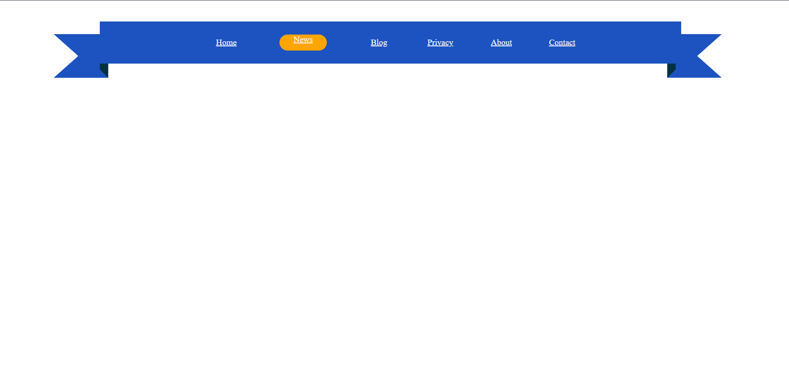

# Navbar challenge 3 #
[project-live](https://navbar-challenge3.netlify.app)
- - - -
 # Technology used in this project #
     
- - - -
* Skill Gained in this project
  * Learned to make the navbar section 
  * Learned to align the __navbar section__ 
  
  * Learned to create buttons using __padding, border, heigth , width, border-radius and bg-clor__
  * Learned to create ribbon using __clip-path__
   * Learned to align the content using __absolute, relative, gap, margin__
   - - - -
 ## Time taken to complete this project ##
 *  1 hrs to completed this poject
 
 ## Screenshot ##
 
 
 
